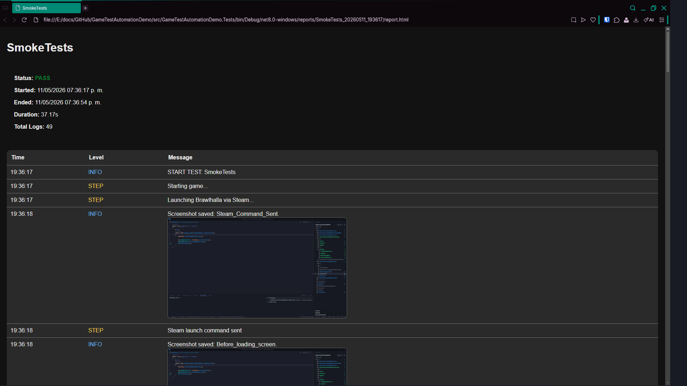

# 🎮 Game Testing Automation Framework (C#)

A computer vision–based automation framework for testing video games and graphical applications.

This project demonstrates how to automate user flows in non-DOM environments (such as games) using image recognition and simulated input.


## 🚀 Features

- 🧠 Computer Vision (OpenCV)
- 🖱️ Input Automation (Mouse, Game-controller simulation)
- 🧪 Test Framework (XUnit)
- ⏱️ Smart waits for non-deterministic systems
- 📸 Screenshot-based validation
- 📊 Test reporting (logs + screenshots)

## 🏗️ Architecture

- **Core** → Orchestration logic
- **Vision** → Detection via template matching
- **Input** → Mouse automation, GamePad emulation
- **Tests** → Test cases (XUnit)
- **Reporting** → Logs and execution artifacts
- **GameObjects** → PageObjectModel implementation


## 🧩 Tech Stack

- C# (.NET 8)
- OpenCvSharp
- XUnit
- WinAPI (mouse input)
- ViGEm (GamePad input)

## 📦 Setup

0. Prerequisites:

    - Brawlhalla installed via Steam.
    - ViGEm driver (You can get it on their official [github releases](https://github.com/nefarius/ViGEmBus/releases))

1. Clone repo:

```bash
git clone https://github.com/ChezterBurster/GameTestAutomationDemo.git
cd GameTestAutomationDemo
```

2. Restore dependencies:

```bash
dotnet restore
```

3. Run tests:

```bash
dotnet test
```

## 🧪 Example Test

```C#
    [Fact]
    public void Should_Launch_And_Navigate_To_Online_Play()
    {
        MainMenu.AssertPlayButtonVisible();

        var modeSelection = MainMenu.GoToOnlinePlay();
        modeSelection.AssertGameModesVisible();
    }
```



## 🧠 How It Works

1. Captures screen
2. Detects UI elements via template matching
3. Simulates user input
4. Validates expected visual state
5. Generates logs and screenshots

## 📊 Output

Each test generates:

- Logs
- Result-dependent screenshots
- Pass/Fail result

## ⚠️ Disclaimer

This project is intended for QA automation and testing environments only.
It does not interact with game memory or bypass protections.

## 📈 Why This Matters

Modern QA roles increasingly require testing beyond web apps.
This project demonstrates:

- Automation of non-DOM systems
- Visual validation strategies
- Handling non-deterministic environments

## 🔍 Engineering Challenges

### Why image recognition instead of memory reading?

This framework intentionally avoids memory manipulation to remain:

- anti-cheat safe
- black-box oriented
- closer to real user interaction
- Why GamePad emulation?

Many modern games ignore WinAPI keyboard injection due to:

- raw input systems
- anti-cheat protections
- direct input polling

To solve this, the framework uses ViGEm virtual controllers.

### Handling non-deterministic systems

Traditional waits are unreliable in games due to:

- frame variance
- animation timing
- loading unpredictability

The framework implements polling-based smart waits with configurable thresholds.

## 👨‍💻 Author

### Kevin Rivera
